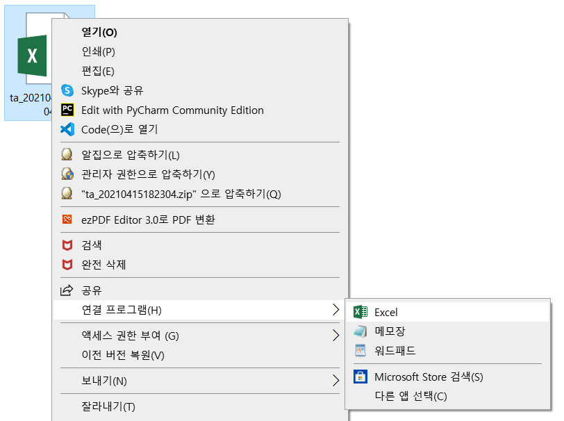
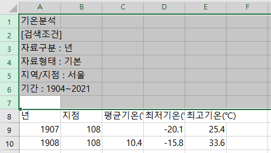

# 공공데이터 활용

## 공공데이터란?
> `공공데이터`는 ‘중앙부처, 지자체, 공공기관이 생산하고 보유 및 관리하고 있는 교통, 기상, 의료, 경제, 환경 등의 모든 데이터를 의미합니다. 
> 버스 실시간 도착정보 서비스,기상청 어플리케이션,한국석유공사의 전국 주유소 유가정보 등이 공공데이터라고 할 수 있습니다.  
> `법률적인 측면`에서 2013년에 제정되고 2014년에 개정된 공공데이터의 제공 및 이용활성화에 대한 법률의 제 1장 2조의 정의하고 있습니다. ‘공공데이터’란 데이터베이스, 전자화된 파일 등 공공기관이 법령 등에서 정하는 목적을 위하여 생성 또는 취득하여 관리하고 있는 광(光) 또는 전자적 방식으로 처리된 자료 또는 정보를 말합니다.’  
> `정보공개법`은 국민의 알권리 충족과 행정투명성의 제고를 목적으로 하며, `공공데이터의 개방`은 여기에서 더 나아가 민간 활용을 통한 국민편의 향상, 신규 비즈니스와 일자리 확충을 목적으로 시행되고 있다는 점이 큰 `차이점`이라 할 수 있습니다.  

## 데이터 분석 
  `문제 정의` - `데이터정의` - `데이터 수집` - `데이터 전처리` - `데이터 시각화` 

## 1. 서울시 온도로 데이터 분석 
* 문제 정의 - 내가 살고 있는 지역의 온도 변화. 봄이 짧아지고 있나?
* 데이터 정의 - 어떤 데이터가 필요할까? 연도별 데이터로 분석가 필요!!
* 데이터 수집 - 기상청 공공데이터를 찾아봅시다

#### 1-2. 데이터 수집 
* 기상자료개방포털(기상청): [https://data.kma.go.kr/](https://data.kma.go.kr/)
* 기상자료개방포털 > 기후통계분석 > 기온분석 메뉴 사용
* 검색 조건을 입력한 후 검색
* csv 파일로 다운로드
* 데이터 파일을 필요한 형태로 정제
  * 엑셀에서 다운로드 파일 열기
    

  * 불필요한 부분 삭제  
  * 헤더 수정  
    

  *
     
  * 파일형식을 csv utf-8(쉼표로 분리)로 선택하여 다른이른으로 저장합니다.
    

  
  * 구글드라이브에 업로드  
      
#### 1-2. 데이터 확인   
* colab 에서 데이터 파일 불러오기    
  `import pandas as pd`    
  `df = pd.read_csv('파일경로/파일명.csv')`    
  `df`    
* colab 폴더에서 파일명을 더블클릭 하면 데이터 내용을 볼 수 있습니다.   
   
#### 1-3. pandas 데이터 정보 확인  
* head() : 불러온 데이터 상위 n행을 출력합니다. 빈 채로 출력하면 디폴트 5개를 출력합니다.  

     
  
   
* describe() : 컬럼 별 통계량을 출력합니다.    
   
* info() : 행과 열의 크기, 컬럼명, 컬럼을 구성하는 값의 자료형 등을 출력합니다.

  

  
  
   Null 값(결측치)이 포함된 것을 알 수 있습니다.  
* isnull( ) : 빈 값에 True를 출력합니다.  
  

 
* isnull( ).sum( ) : 컬럼 별 빈 값 개수를 출력합니다.   
  

   

* mean( )함수로 해당 컬럼의 평균값을 구할 수 있습니다.  
  

   
  
## 2. 연령별 인구 시각화  
#### 2-2. 데이터 수집: 행정안전부 : [https://www.mois.go.kr](https://www.mois.go.kr)  

    
* 전체시군구현황 선택, cvs파일 다운로드
  

  
  
* 헤더 수정, 컬럼수정 (불필요한 부분 삭제) , 숫자의 쉼표 제거
  

   
  
* 행,열 변환  
  

   
  
* 엑셀 선택하여 붙여넣기 > 바꾸기
  

   
  
* 헤더 바꾸기
  

  
 
* 파일명, 파일형식 변환 - 다른 이름으로 저장  
* 코랩에 파일 업로드  
* 한글 폰트 설치
  

   
  
* 판다스 데이터프레임으로 읽기 - 지역별 인구 행렬 변경,전체인구 항목 추가
  

   

## 3. 관심 있는 데이터를 찾아 시각화하기
* 제출물 : 아래 두 파일을 이름.zip으로 묶어서 제출
  - 데이터 파일 (.csv)
  - 코랩 파일(.ipynb)
* 텍스트셀에 아래 내용을 간단히 작성 - 데이터 출처,데이터 작성 이유

## 4. 공공데이터 데이터
* 공공데이터 포털(행전안전부)[https://www.data.go.kr/](https://www.data.go.kr/)
* 국가통계포털(통계청) [https://kosis.kr/](https://kosis.kr/)
* 고속도로 데이터 포털(한국도로공사) [https://data.ex.co.kr/](https://data.ex.co.kr/)
* 서울 열린 데이터 광장(서울시) [https://data.seoul.go.kr/](https://data.seoul.go.kr/)
* 경기데이터 드림(경기도) [https://data.gg.go.kr/](https://data.gg.go.kr/)
* 캐글(데이터 경영 플랫폼) [http://www.kaggle.com/](http://www.kaggle.com/)

